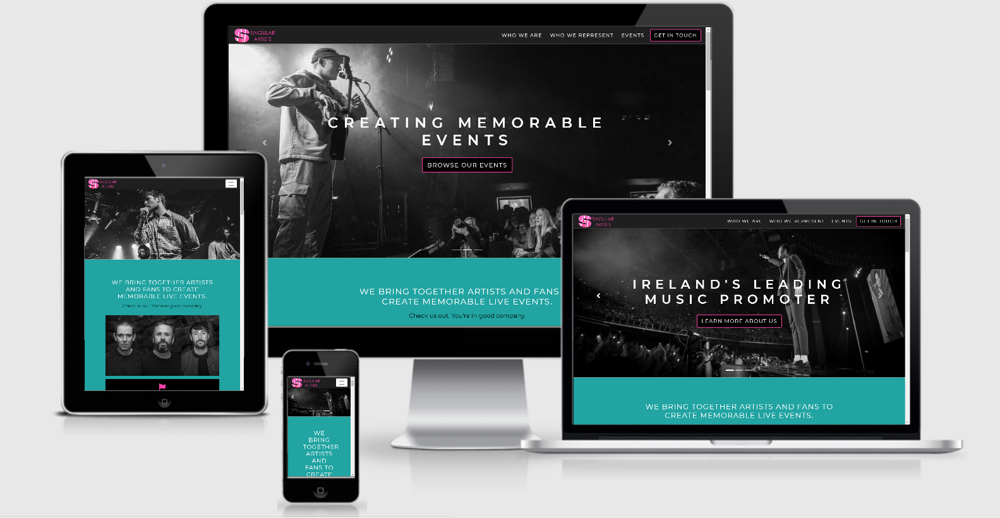
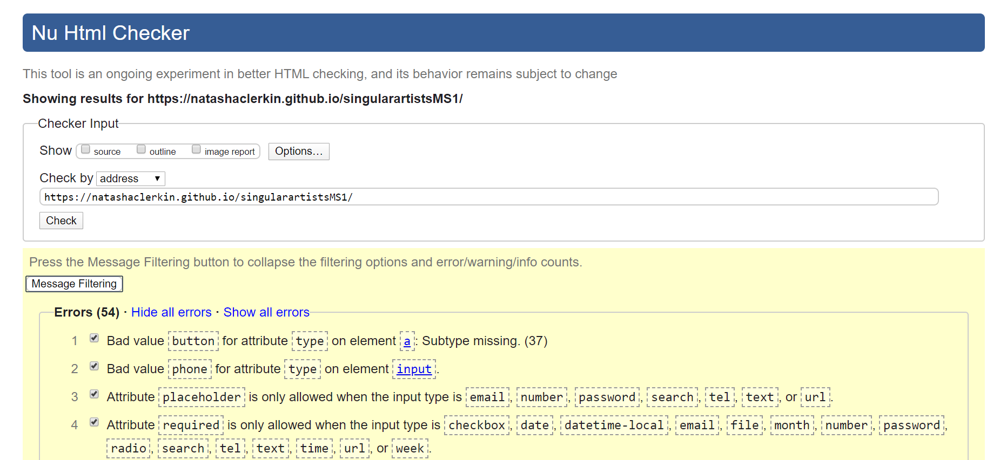
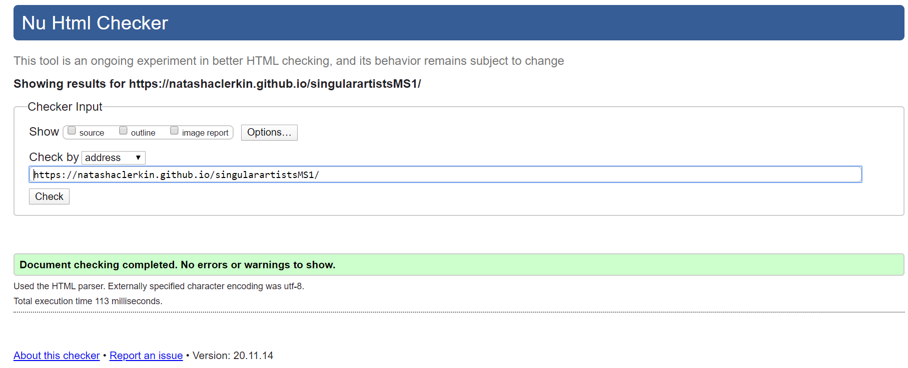
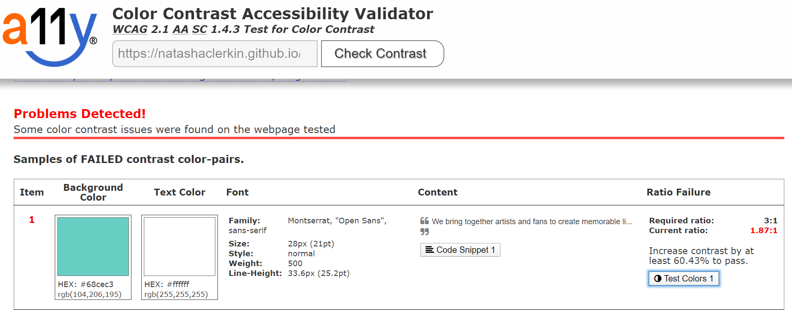
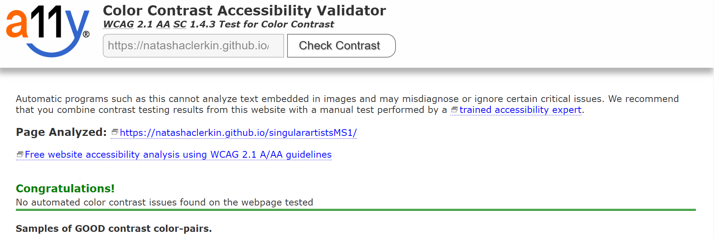
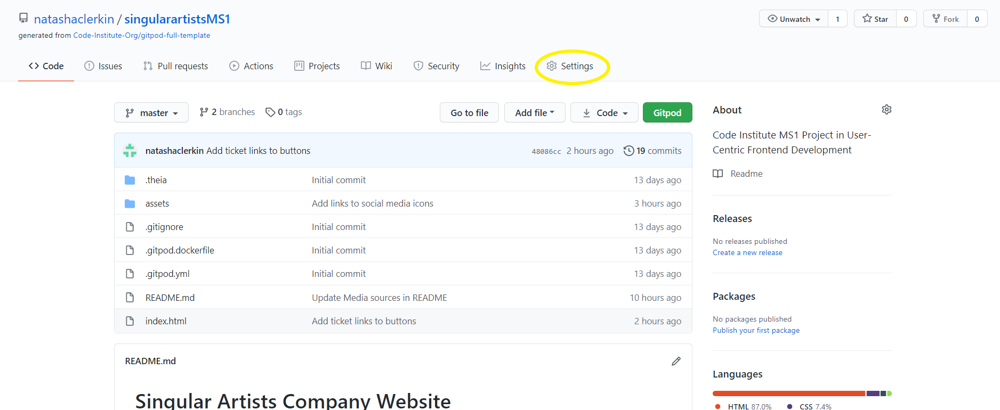
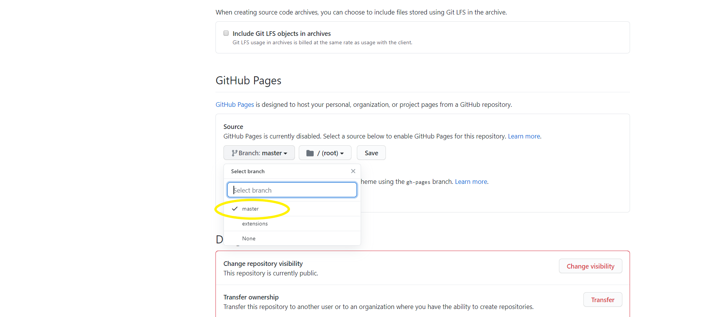
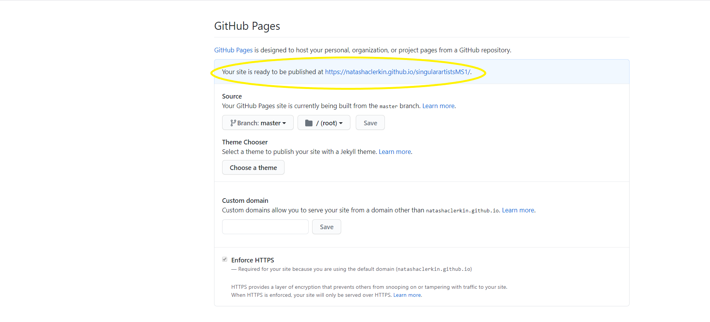
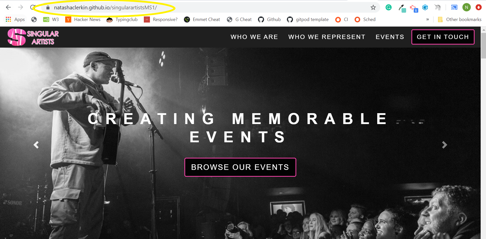

# SingularArtists.ie

## Code Institute MS1 Project in User-Centric Frontend Development 
The brief was to develop a static front end project with a minimum three separate page areas using HTML and CSS while following UX industry standards. This website is created for educational purposes.

[View website in GitHub Pages.](https://natashaclerkin.github.io/singularartistsMS1/) 
 
 
 
Image produced from [Am I Responsive](http://ami.responsivedesign.is)

## [SingularArtists.ie](https://natashaclerkin.github.io/singularartistsMS1/) 

The website is created to showcase Irish promoter Singular Artists' work in the event industry. The website highlights various clients the company are representing and their wealth of experience in the industry. 

The site features an about section, a section listing all clients represented, an events listing section and a contact section. There is also a social media plugin to display active promotion to users. 

The primary goal of the website is to inform and direct users to the contact form. As a B2B website, the aim is to convey credibility and assurance to the user. The website layout and navigation structure will guide the user to company information and clientlist highlighting it's reliability and expertise. These sections along with the CTA's will lead the user towards the contact form.  

**The business goals of this website are:**

- To inform users about the exciting client base.
- To increase brand recognition.
- To encourage potential clients to establish contact with the team.

**The customer goals of this website are:**

- To find out more information about the company and it's experience in the industry. 
- To seek validation that the company are reputable and credible in order to potentially build a long-term working relationship.
- To find out which artists the company represents and venues they are currently working with in order to gauge successful ticket sales and events.
- To view evidence of promotional activity such as active social media channels marketing and promoting their current clients.
- To effortlessly find contact information to touch base with the team.

## UX

### Strategy

My strategy for the site was to provide reputable content and ease of access to users trying to attain information by utilising key UX principals.
I wanted to incorporate the majority of elements from [Peter Morville's UX Honeycomb](https://books.google.ie/books?id=yLd9DwAAQBAJ&lpg=PA6&dq=ux%20honeycomb%20peter%20morville&pg=PR1#v=onepage&q=ux%20honeycomb%20peter%20morville&f=false) to create a great experience for the user. In particular, I believed that the aspects of "Credible", "Valuable" and "Usable" were highly significant to implement in this project. I felt that the owner images and client list would add to the credibility of the company and the overall site.   

#### Ideal users of this website:
- Artists/Bands/Agents
- Venue Managers
- Ticketing Providers

#### These users are looking for:
- An experienced, credible promoter to work with
- Evidence of promotional work

#### This project is the best way to achieve their goals because:
Most promoter websites increase the cognitive load on the user. This website enables effortless navigation through the pages building assurance and directing the user towards the contact elements.

#### User Stories

1. **_As a Venue Manager,_** I want to find out the artists the promoter works with so that I can decide if there is potential to reach capacity and sell-out nights at our venue. 
2. **_As a Venue Manager,_** I want to discover what experience the company has so that I can evaluate if they have enough expertise to work with our venue. 
3. **_As a Venue Manager,_** I want to check out their social media channels to view their current promotional activity to see if they can successfully market events.
4. **_As an Artist/Agent,_** I want to learn about the type of artists the promoter is working with so that I can view previous marketing strategies and the ability to potentially promote our future gigs. 
5. **_As an Artist/Agent,_** I want to view the company history as I want to work with an experienced promoter who is well connected within the industry. 
6. **_As a Ticketing Agent,_** I want to learn about the promoter’s artists and venues so that I can evaluate ticket sales potential. 
7. **_As a Ticketing Agent/Artist/Agent/Venue Manager,_** I want to find out if the promoter is reputable, credible and approachable in order to potentially be able to build a long-term relationship. 

### Scope
To achieve the strategy goals, I wanted to include the following features in this production release:
- **Header** containing company logo and navigation bar
- **Carousel** using powerful imagery of current artists at live gigs
- **Company image and info** detailing experience in the industry
- **Clientlist** with artist bio and links to social media 
- **List of upcoming events** linking to ticketing provider
- Simple **Contact Form** 
- **Footer** containing links to social media

### Structure 

I decided to create a single page website incorporating only the necessary actions and info required by the ideal users to reduce cognitive overload. 
The navigation bar would include the links to all four sections on the right and the company logo/home link placed on the left to follow industry standard and create familiarity with the user. 
This allows the user to easily learn and understand the structure and effortlessly navigate through the site when using it for the first time. 
I decided that the links would also be strategically placed in the intended journey the user should follow. i.e. About->Artists->Events->Contact. This would allow the user to learn about the experience the promoter has, their credibility in the industry with the artists they represent, the large number of events presented in order to gain the user's trust propelling them towards the contact form. 
 
### Skeleton
- [Wireframes](assets/wireframes/wireframes.pdf "Singular Artists Wireframes"): Website contains 4 sections; About (Who We Are), Artists (Who We Represent), Events and a Get In Touch section. I had originally thought about creating a website with a homepage and 4 separate pages but later decided to compile all sections into a single page website to create a better flow.
**Please note the finalised website contains slight variations to the original wireframe**

### Surface 

The company logo incorporates the vibrant dual colours of white and bright pink. 
The promoters selected the striking colours to convey a sense of confidence and excitement as a reflection of their industry.
I wanted the brand colours to feature as the hover/accent colours in the Call To Action buttons to connect the brand with the actions taken by the user. To allow the CTA's and brand colours to stand out and gain the attention of the user, I wanted to keep the majority of the site monochrome with black and white text and teal to tie the colours together. This also allows the website to appear less cluttered and minimalistic adding to the overall UX. This color scheme was chosen to create a sleek and modern feel in keeping with the brand.
I wanted to use the Montserrat font and Sans-Serif back up fonts to maintain the clean-cut image.

## Features

The fully responsive website consists of the header, footer and four sections; About (Who We Are), Artists (Who We Represent), Events and the Contact Form. Each section has a H3 heading describing the section content along with a sub heading directing the user how to operate the content if required. I used Hover.css on the navlinks, CTA's and social media icons to create an enjoyable navigation experience for the user and to highlight that the website is functioning correctly. I used the Bootstrap​ plugin, Scrollspy, to automatically update links in the navigation list based on the current scroll position. I also wanted to highlight the colour of the current section with the accent colour to remind the user of their location on the site. I wanted to adjust the opacity of the navbar to allow it blend in with the site and not take too much attention away from the content. On small devices I decided to code the navbar to collapse into a hamburger menu as it is ubiquitous and users understand it's purpose on mobile sites. All sections are linked by CTA's at the bottom of their section guiding the user towards the contact form once they have learnt about the company.

**Header:**
The header features a responsive navigation bar with links pointing to each individual section on the right hand side with the company logo placed on the left to follow standard industry practice. The navbar is fixed to allow the user ease of access to the site’s core functionalities and as a result generates high usabilty for the one page website. 
It contains a Bootstrap carousel of three striking images of current artists performing live. This signifies the popularity of the artist and successful events run by the company. The larger the crowd displayed in the image, the greater the indication of high revenue and high success for potential clients. Each image points to the three informative sections of the website; who the company are, who the company represents and upcoming events. Each image includes a caption reflecting that particular section and a CTA. The header was intentionally designed with a monochrome theme to strategically draw the user's attention to the brand logo and accent colours on the CTA's. I applied the `filter` property with the values of `brightness(95%)` and `saturate(0%)` to the Carousel images to achieve this goal.

**About (Who We Are):** 
The About section features an image of the three company directors along with three reasons why potential clients should work with the company to create symmetry. Font Awesome icons and captions are used above each paragragh to add visual meaning to the text and display the information in a way that is faster
to comprehend should the user not wish to read the entire paragraghs. I used Bootstap cards to display the content uniformly.

**Artists (Who We Represent):**
The Artists section features a Bootstrap Modal Gallery displaying thumbnails in a grid. When the user clicks on an image, a Modal pops up displaying a YouTube link, a short bio and links to their personal website and social media channels.

**Events:**
The Events section features a Bootstrap Carousel of Cards displaying the upcoming events of the clientbase. Each Card features the main event info and the link to the ticketing provider. The Carousel slides automatically but can be manually selected via the controls.

**Contact Form:** 
Finally once the user has gained knowledge and confidence from the content, they are presented with a simple Contact Form. The form is compiled of only the necessary information required to avoid the user losing interest and not making contact. 

**Footer:**
The footer section contains contact and copyright information as well as links to the company's Social Media channels. I also wanted to add a link to allow the user to jump back to the top instead of scrolling to further improve the overall UX.

### Features Left to Implement
Due to time restraints I was unable to include the following features but hope to implement them in a future release:
- Embed social media feeds & Spotify playlist - Showcase promotional activity and create buzz for the clientbase.
- Blog - To provide updates and reviews of events, and artists' news.
- Live Chat app - To provide instant connection between the user and company with high visibility on the site.  

# Technologies Used

In the construction of this project I have utilised the following languages, frameworks, libraries and tools:
- **HTML5** and **CSS3** programming languages
- [Bootstrap v4.5.3](https://getbootstrap.com)
    - The project used **Bootstrap** to simplify the website layout by integrating the Modals for further artist info and the Cards for event listings and company info. Also to provide overall responsive behaviour on all devices.
- [GitPod](https://www.gitpod.io/)
    - I used **GitPod** as the development environment for my website. I also used Git for Version Control in the project.
- [GitHub](https://www.github.com/)
    - The project used **GitHub** to host my code that was created and pushed from GitPod.
- [Balsamiq](https://balsamiq.com/)
    - I used **Balsamiq**, the rapid low-fidelity UI wireframing tool during the prototyping phase to structure the website and it's content following best UX practices.
- [Photoshop](https://www.photoshop.com)
    - I created the text segment of the company logo using the image graphics editor **Photoshop** so the website/company name would be visible to the user upon landing on the site.
- [Chrome Dev Tools](https://developers.google.com/web/tools/chrome-devtools)
    - **Chrome Dev Tools** was used to consistently test and view the project in the browser.
- [Google Fonts](https://getbootstrap.com)
    - **Google Fonts** was used to style the website fonts.
- [Font Awesome](https://fontawesome.com/)
    - I used the font & icon toolkit **Font Awesome** in the company section and the social media links to provide a definition to elements by a visual means.
- [TinyPNG](https://tinypng.com)
    - The **TinyPNG** website was used to reduce the file size of my image files in order to use less bandwidth and allow the website to load faster.
https://www.freeformatter.com/css-beautifier.html
https://www.freeformatter.com/html-formatter.html#ad-output
further compressed https://imagecompressor.com/

- [Unicorn Revealer](https://chrome.google.com/webstore/detail/unicorn-revealer/lmlkphhdlngaicolpmaakfmhplagoaln)
    - I regularly used the **Unicorn Revealer** Chrome extension to inspect and locate where overflow was located making the debugging process alot easier. 
- [YouTube](https://youtube.com)
    - For all my modal music video links, I used the video-sharing platform **YouTube** to visually showcase the artist and their genre to the user. 
- [Favicon.io](https://favicon.io/)
    - **Favicon.io** was used to generate the favicons for the site.
- [Autoprefixer](https://autoprefixer.github.io)
    - The project used PostCSS plugin **Autoprefixer** which parsed my CSS and added vendor prefixes to allow cross-browser compatibility and support.
- [Color Contrast Accessibility Validator](https://color.a11y.com/)
    - The **Color Contrast Accessibility Validator** was used to test for colour contrast on the project.
- [W3C Markup Validation Service](https://validator.w3.org/)
    - The **W3C Markup Validation Service** checked the markup validity of Web documents in HTML.
- [W3C CSS Validation Service](https://jigsaw.w3.org/css-validator/)
    - **W3C CSS Validation Service** was used to check the validity of my CSS in the project.

## Testing

noreferrer

add js bug fix
### UX stories testing

1. **As a Venue Manager/ Ticketing Agent/ Artist/ Agent: I want to view the company information and experience**

    (i) From the first glance, there is an option in the navigation bar called "Who We Are" to learn more about the company. Also in the slider there is a caption reading "Ireland's Leading Music Promoter" with a CTA displaying the text "Learn More About Us". Both links direct to the relevant section.

2. **As a Venue Manager/ Ticketing Agent/ Artist/ Agent: I want to find out the artists the promoter works with**

    (i) There is clear direction in the navbar that to find out more info on the artists represented, the link for "Who We Represent" should be selected. Also in the Carousel in the header there is a caption "Artist-First Ethos" and a Call To Action button to "Check out our Artists". Both links direct to the correct section. The sub-heading text reads that the user can learn more by selecting a particular artist. Once selecting an artist, a pop up opens up to reveal a music video link, a short bio and links to the artist's social media and website.

3. **As a Venue Manager/ Ticketing Agent/ Artist/ Agent: I want to check out their upcoming events.**
   
    (i) At the top of the site, there is a link to events as well as a slider with an image and caption "Creating Memorable Events" and the CTA inviting the user to "Browse Our Events". Both links divert to the correct area. The sub-heading prompts the user to browse the current events. The slider can be selected by the left and right controls. The user can "Get Tickets" by clicking the link which brings them to an external ticketing site.  

4. **As a Venue Manager/ Ticketing Agent/ Artist/ Agent: I want to check out their social media channels**

    (i) There are social media icons found in the footer which link to the company's channels.

4. **As a Venue Manager/ Ticketing Agent/ Artist/ Agent: I want to contact the promoter about working together**

    (i) There is a prominent button at the top of the page directing the user towards the contact form. The form does not allow the user to submit until all fields are completed otherwise they will receive a prompt. There is also contact details found in the footer. 

I used the [W3C Markup Validation Service](https://validator.w3.org/) to check the Markup and [W3C CSS Validation Service](https://jigsaw.w3.org/css-validator/) to check the CSS validity of the site.

After fixing the errors on both testing sites, the site eventually passed the W3C Validation.

The [Color Contrast Accessibility Validator](https://color.a11y.com/) was used to test for colour contrast on the project.

I found the original teal shade wasn't working from an Accessibility standpoint so I decided to change the colour to a darker shade to comply with Accessibility standards.

In addition, you should mention in this section how your project looks and works on different browsers and screen sizes.

You should also mention in this section any interesting bugs or problems you discovered during your testing, even if you haven't addressed them yet.

I asked my family, friends and fellow students to test their site on different devices to check for potential bugs.

## Deployment

This site is hosted using GitHub pages, deployed directly from the master branch. The deployed site will update automatically upon new commits to the master branch. In order for the site to deploy correctly on GitHub pages, the landing page must be named index.html.

To run locally, you can clone this repository directly into the editor of your choice by pasting git clone https://natashaclerkin.github.io/singularartistsMS1 into your terminal. To cut ties with this GitHub repository, type git remote rm origin into the terminal.

My project was developed using the IDE, Gitpod. I deployed my website from the GitHub repository to GitHub Pages using the following steps:

1. I selected the Settings tab in my GitHub repository.

2. I located the GitHub Pages section and chose the Master branch as the source to enable GitHub Pages.

3. Once I saved the Master Branch as the source, the page refreshed and I located the URL to the deployed website.

4. I then followed the link to observe and verify the published GitHub page. 

## Credits

### Content
The text for the About Section was adapted from:
- the [Nialler9 article](https://nialler9.com/new-irish-music-promotions-company-singular-artists)
- the [Pollstar article](https://www.pollstar.com/article/singular-artists-new-irish-promoter-in-town-backed-by-kilimanjarodeag-146376 )
- the [IQ article](https://www.iq-mag.net/2020/09/deag-launches-ireland-singular-artists)

 
### Media
 The images used in this site were obtained from the following sources:

- Singular Artists Company Logo - [from Singular Artists' Facebook Page](https://www.facebook.com/wearesingularartists/photos/a.100978908278580/118419983201139/?type=3&theater)
- Singular Artists Company Directors Image - [from Pollstar](https://www.pollstar.com/article/singular-artists-new-irish-promoter-in-town-backed-by-kilimanjarodeag-146376 )
- Dermot Kennedy Carousel Image - [from Ambient Light](https://www.ambientlightblog.com/dermot-kennedy-auckland-nz-2019/dermot-kennedy-feature/)
- Picture This Carousel Image - [from Golden Plec](https://www.goldenplec.com/galleries/picture-this-at-3arena/#image-18)
- Fontaines DC Carousel Image - [from Pollstar](https://www.pollstar.com/article/first-etep-2019-results-already-10-confirmed-festival-slots-for-fontaines-dc-137581)
- Fontaines DC Gallery Image - [from The Face](https://theface.com/music/fontaines-d-c-punk-poetry-a-heros-death-dogrel-interview-grian-chatten)
- Dermot Kennedy Gallery Image - [from Irish Central](https://www.irishcentral.com/culture/entertainment/irish-singer-dermot-kennedy)
- Picture This Gallery Image - [from Official Charts](https://www.officialcharts.com/chart-news/picture-this-top-10-biggest-songs-on-the-official-irish-singles-chart__25912/)
- Sam Wickens Gallery & Event Listing Image - [from Sam Wickens Twitter Account](https://twitter.com/samwickensmusic)
- Ailbhe Reddy Gallery & Event Listing Image - [from Read Dork](https://www.readdork.com/features/getting-to-know-ailbhe-reddy)
- Boy Pablo Gallery & Event Listing Image - [from Teco Apple](https://tecoapple.com/2020/07/13/boy-pablo-lanca-o-single-honey-e-o-b-side-jds-song/boypablohoneya020/)
- Reevah Gallery & Event Listing Image - [from XS Noise](https://www.xsnoize.com/interview-with-derry-based-americana-folk-artist-reevah/)
- Novo Amor Gallery & Event Listing Image - [from Mr Life Day](https://mrlifeday.com/novo-amor-birthplace-and-interview/)
- Pillow Queens Gallery & Event Listing Image - [from Giglist](https://giglist.com/buzz/article/review-pillow-queens-handsome-wife)
- Elderbrook Gallery & Event Listing Image - [from Official Charts](https://www.officialcharts.com/chart-news/elderbrook-explores-the-power-of-human-connection-on-his-debut-album-why-do-we-shake-in-the-cold-first-listen-preview__31001/)
- Maija Sofia Gallery & Event Listing Image - [from Strange Brew](https://www.strangebrew.ie/new-events-1/2020/2/20/maija-sofia)
- Rhys Lewis Gallery & Event Listing Image - [from The Evening Standard](https://www.standard.co.uk/showbiz/celebrity-news/rhys-lewis-my-songs-are-so-personal-it-can-be-awkward-for-the-people-in-them-a3427356.html)
- Fontaines Gallery & Event Listing Image - [from Pollstar](https://www.pollstar.com/article/first-etep-2019-results-already-10-confirmed-festival-slots-for-fontaines-dc-137581)

 The video links used in this site were obtained from the following sources:
- Fontaines DC Modal Video - [from Youtube](https://youtu.be/TNXrKBt76zI)
- Dermot Kennedy Modal Video - [from Youtube](https://youtu.be/Fi33qkv4Bjw)
- Picture This Modal Video - [from Youtube](https://youtu.be/HJs3O7rb9zY)
- Sam Wickens Modal Video - [from Youtube](https://youtu.be/JqFwORSs8PY)
- Ailbhe Reddy Modal Video - [from Youtube](https://youtu.be/aZ-dzPQADi4)
- Boy Pablo Modal Video - [from Youtube](https://youtu.be/HZ4bTlHjA_I)
- Reevah Modal Video - [from Youtube](https://youtu.be/uyJxlUXJCMI)
- Novo Amor Modal Video - [from Youtube](https://youtu.be/utj0BFuv1-Q)
- Pillow Queens Modal Video - [from Youtube](https://youtu.be/fvHd0vId3uo)
- Elderbrook Modal Video - [from Youtube](https://youtu.be/ooD1ggdZ8dg)
- Maija Sofia Modal Video - [from Youtube](https://youtu.be/gbnD-tRI8-4)
- Rhys Lewis Modal Video - [from Youtube](https://youtu.be/srfl7PnoaQE)

### Acknowledgements

I received inspiration for this project from my ticketing client, Singular Artists who have yet to set up their company website.
I would like to thank my mentor Guido Cecilio for his guidance and support and Jim Morel on Slack.
<!-- Code Snippet: Implemented Scrollspy from: https://getbootstrap.com/docs/4.5/components/scrollspy/ -->
      <!-- START OF NAVBAR - Code Snippet: Navbar and carousel to fix previous bug with my own custom code from: https://www.divinector.com/2019/07/bootstrap-4-navbar-with-slider-source.html -->
      <!-- START OF COMPANY SECTION - Code Snippet:- Maintain equal height in cards from: https://stackoverflow.com/questions/35868756/how-to-make-bootstrap-4-cards-the-same-height-in-card-columns -->
         <!-- START OF ARTISTS GALLERY WITH MODALS Code Snippet:- Add Modal Gallery with my own custom changesfrom: https://mdbootstrap.com/plugins/jquery/gallery/ -->
         <!--Code Snippet:- Carousel Wrapper with own custom code from https://mdbootstrap.com/snippets/jquery/alexpiffero-it/696600#html-tab-view-->
         <!-- START OF CONTACT FORM - Code Snippet:-Took basic form structure and customised with own content from https://getbootstrap.com/docs/4.0/components/forms/#form-groups -->
         <!-- START OF FOOTER - Code Snippet:- Took slight inspiration for the icons and links with my own custom code from https://bootstraptor.com/snippets/bootstrap-4-snippet-footer-links-logo/ -->
       <!-- Active script credited to Jim Lynx from Code Institute in assistance with active link issue -->
      <!-- Modal script credited to mentor Guido Cecilio from Code Institute in assistance with active link issue -->